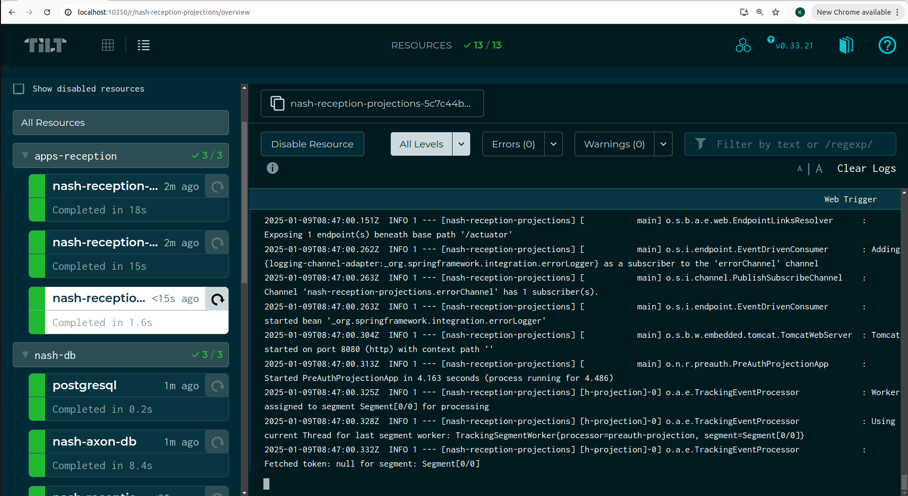
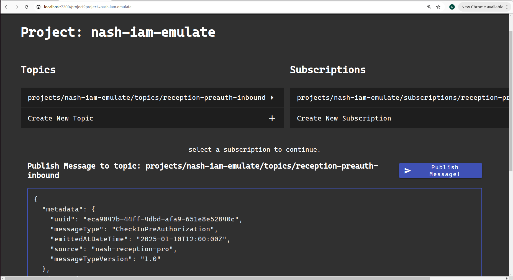
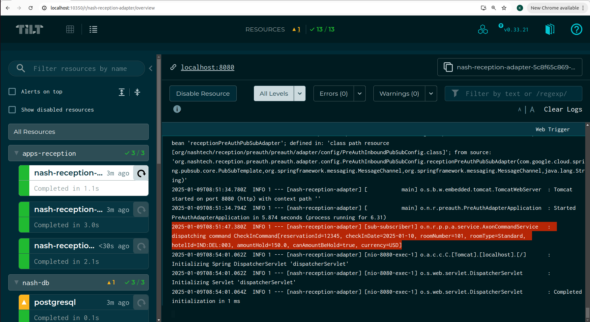
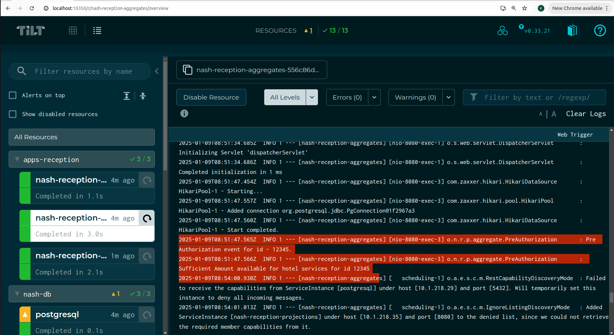
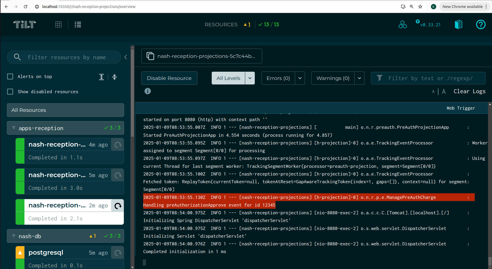
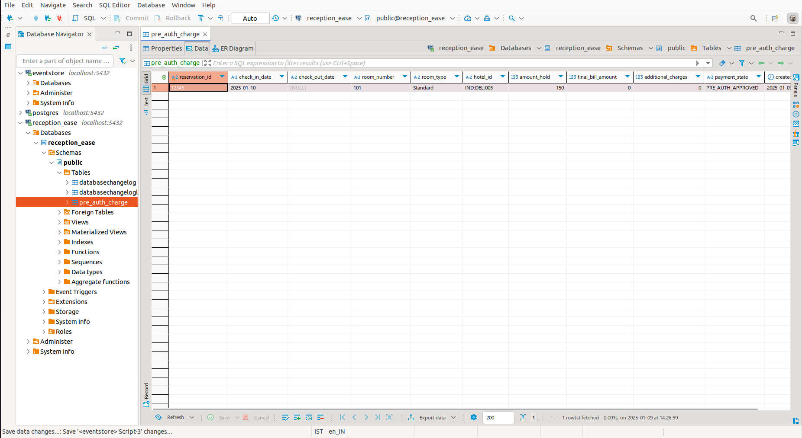
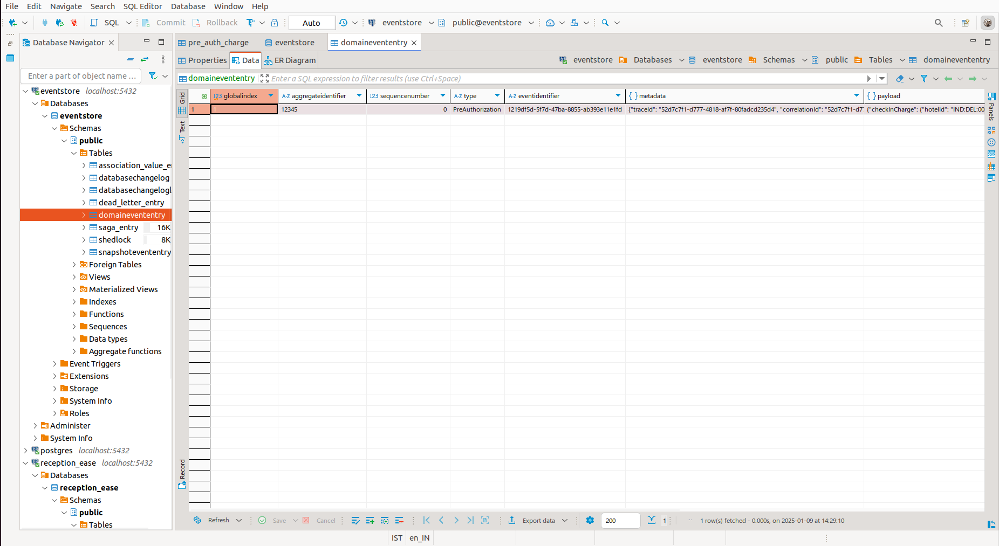

# AxonSpringIntegrationTilt-Demos

This template demonstrating the use cases of axon, spring-integration, gcp pubsusb, tilt. 

Leverage the power of Axon, Spring Integration, and Pub/Sub to seamlessly streamline your domain logic,
enabling independent scaling and efficient execution. 

With Tilt, effortlessly create a self-contained, local development environment that frees you 
from relying on infrastructure, making your workflow faster and more flexible.

This template features a variety of modules, each with its own specific responsibility,
designed to work together seamlessly:

1. **nash-reception-adapter:** It is a spring-boot app that work as anti corruption layer. It is responsible to 
   receives messages from upstream system via pubsub, segregate them to different Inbound messages based on message payload,
   convert those inbound messages to respective axon commands to be send to domains/aggregates. This layer is capable of
   publishing commands to remote nodes running the handlers of these commands.(Axon distributed command bus working with native kubernetes discovery).
2. **nash-reception-aggregate:** It is a spring-boot app that represent the Domain Logic. It receives axon Commands from adapter, do business validations,
    Publish business events to show the change in the domain. Currently, It is implementing the pre-authorization state transition given below.

3. **nash-reception-projections:** It is a spring-boot app that react to the changes in the domain. It has axon event
   handlers that subscribed the events and update the projection database.
4. **nash-reception-liquibase:** It has database migration. It is tracking, managing and applying database schema changes for both axon and projection 
   database objects required for above spring-boot apps.
5. **nash-reception-command-api:** It has commands and events used across apps.
6. **infra:** It spin up local pubsub.

### How to Run- 

Tilt is set up to spin-up infra required, and run the application on local kubernetes.

#### Prerequisites
1. Java 21
2. docker
3. helm
4. tilt
5. kubernetes: microk8s/Docker Desktop

##### On linux,

-- install microk8s
1. `sudo snap install microk8s --classic && sudo microk8s.enable dns && sudo microk8s.enable registry`
2. `sudo microk8s.kubectl config view --flatten > ~/.kube/microk8s-config && KUBECONFIG=~/.kube/microk8s-config:~/.kube/config kubectl config view --flatten > ~/.kube/temp-config && mv ~/.kube/temp-config ~/.kube/config && kubectl config use-context microk8s`
3. `sudo microk8s start`

-- install tilt
curl -fsSL https://raw.githubusercontent.com/tilt-dev/tilt/master/scripts/install.sh | bash

now run inside AxonSpringIntegrationTilt-Demos-
`tilt up`

Navigate to http://localhost:10350/ to see the Tilt UI.
The Tilt UI can be used to view logs for each of the services and trigger service rebuilds.

Navigate to pusub ui to ingest messages
The GCP pubsub emulator UI can be accessed at http://localhost:7200 

Take the message from 
`nash-reception-adapter/src/test/resources/check-in.json` paste to the pubsub ui and click publish

#### Results-
Check the logs in services
1. adapter

2. aggregate

3. projection

see the database projection table pre_auth_charge

you can check the domain event in event store

